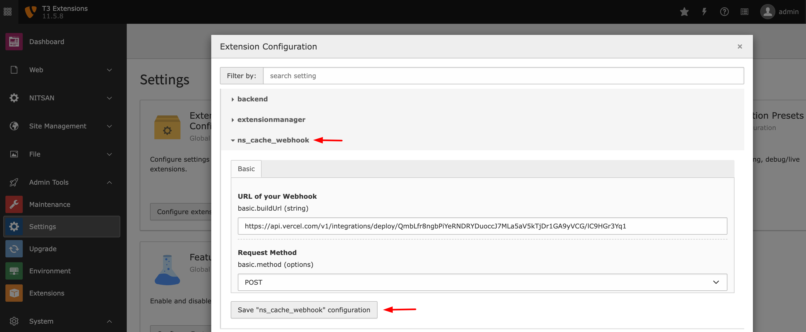

.. _configuration:

=============
Configuration
=============

Settings of your Webhook
=========================

**Step 1:** Go to Admin Tools > Extension Configuration > EXT.ns_cache_webhook at TYPO3 Backend.

**Step 2:** Add "URL of your Webhook" and choose "Request Method" (Highly recommend to select POST)

**Step 3:** Don't miss to click on "Save Configuration" button ;)
