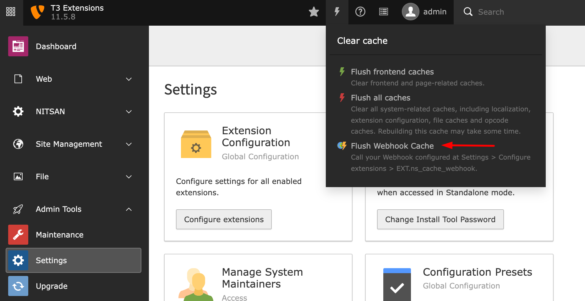

.. _usage:

==========
How to Use
==========

After Installation and Configuration of the extension, You should able to see one more option at Flush cache menu. Check below screenshot.

**Step 1:** Go to Clear cache menu at top right-side corner in TYPO3 backend

**Step 2:** Click on "Flush Webhook Cache"

**Step 3:** Done! Your webhook URL should call by the TYPO3!
